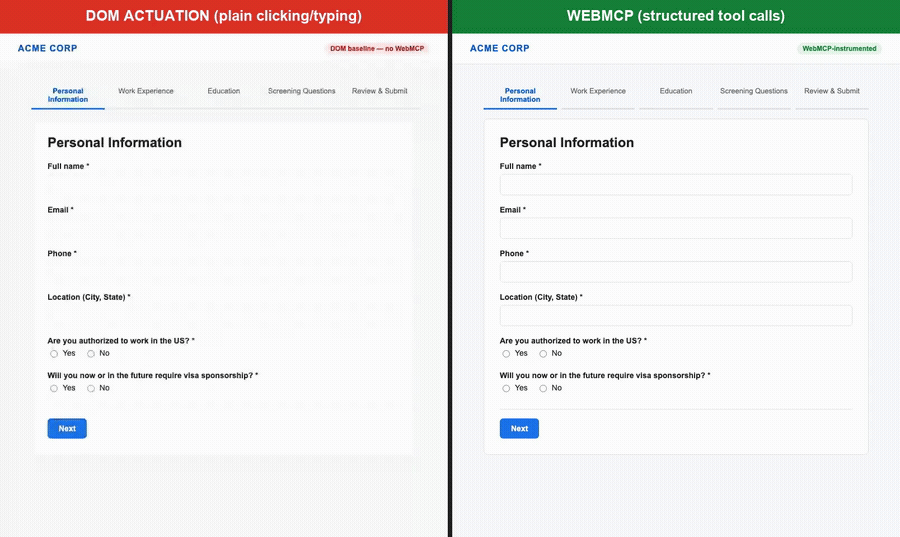
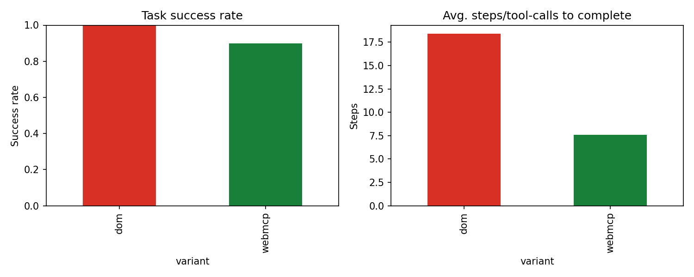

# WebMCP Actuation Benchmark

**A benchmark comparing plain-DOM browser automation vs. Chrome's WebMCP
tool-calling API, on a realistic multi-step structured web form.**



*Left: an agent actuating the form via plain DOM clicks/typing. Right: the
same task via WebMCP structured tool calls. Both scripted deterministically
for this recording (not an LLM run) — see [Results](#results-gpt-4o-10-trials-per-variant)
below for the actual LLM-agent benchmark numbers. Full video:
[`assets/side_by_side_demo.mp4`](assets/side_by_side_demo.mp4).*

## Why this exists

Multi-step web forms — job applications, expense reports, insurance claims,
government paperwork — are one of the most common tasks people now hand off
to AI agents, and one of the least reliable. An agent has to locate the right
input among dozens of DOM elements, handle conditional fields, repeatable
sections (multiple entries, multiple line items), and multi-page flows, with
no guarantee it clicked the right thing.

[WebMCP](https://developer.chrome.com/docs/ai/webmcp) is Chrome's proposed
answer: instead of an agent guessing at DOM structure, a site declares
structured tools with a JSON Schema, and the agent calls them directly — the
same idea as MCP (Model Context Protocol), but for the web. Chrome's own
WebMCP docs cite a `submit_application` tool for exactly this kind of
structured-form use case as one of their primary examples.

This repo builds the same multi-step form twice — once as a plain DOM
form, once instrumented with WebMCP tools — and benchmarks how an AI agent
performs on each: success rate, number of actions required, and failure
modes.

## What's in here

```
demo-dom/       Multi-step structured form, plain DOM only (baseline)
demo-webmcp/    Identical form + WebMCP tool registration
shared/         Shared schema, styles, and the on-device AI assist feature
harness/        Benchmark runner, LLM agent harness, results, analysis/charts,
                and the side-by-side demo recording scripts
assets/         Generated side-by-side demo video/GIF
```

### The two demo variants

Both variants render the *exact same* form (`shared/schema.js` is the single
source of truth: 5 steps — personal info, a repeatable "entries" section,
a details section, screening/qualifying questions, review/submit — including
conditional fields that only appear when relevant, e.g. a follow-up detail
field revealed only after a specific radio selection).

- **`demo-dom/`** — an agent must actuate this like a human: find each
  input by inspecting the page, click radios/checkboxes, type into fields,
  click "Next", handle the repeatable "Add another position" button, etc.
- **`demo-webmcp/`** — the same task is exposed via
  [`document.modelContext.registerTool()`](https://developer.chrome.com/docs/ai/webmcp/imperative-api):
  `fill_personal_info`, `add_work_experience`, `fill_education`,
  `fill_screening_questions`, `draft_with_ai`, and `submit_application`.
  An agent calls these directly with structured arguments instead of
  simulating clicks and keystrokes.

### On-device AI feature (Chrome built-in AI / Prompt API)

Both variants also include an "✨ Draft with on-device AI" button on
free-text fields (a motivation/interest statement, a details field, etc.),
wired to Chrome's
[Prompt API](https://developer.chrome.com/docs/ai/prompt-api)
(`window.LanguageModel` / Gemini Nano running locally in the browser — no
server round-trip). See `shared/ai-assist.js`. It falls back to static text
when the built-in model isn't available (non-Chrome browser, flag not
enabled, headless Playwright without the model downloaded) so the demo
always works end-to-end regardless of environment.

### A note on WebMCP availability

As of this writing, `document.modelContext` is gated behind
`chrome://flags/#enable-webmcp-testing` or an origin trial in bleeding-edge
Chrome builds, and isn't present in the Chromium build Playwright bundles.
To make the benchmark runnable today, `shared/webmcp-polyfill.js` provides a
disclosed, documented polyfill matching the real API's shape
(`registerTool` / `getTools`) — it's a no-op the moment a real
`document.modelContext` is detected, so this becomes forward-compatible with
native support with zero code changes.

## Running it locally

```bash
git clone <this-repo>
cd webmcp-actuation-bench
python3 -m venv .venv && source .venv/bin/activate
pip install -r requirements.txt
playwright install chromium

# Serve the demo apps
python3 -m http.server 8842 &

# Open in a real Chrome tab to try it by hand:
#   http://localhost:8842/demo-dom/index.html
#   http://localhost:8842/demo-webmcp/index.html
```

### Regenerating the side-by-side demo recording

```bash
python harness/record_demo.py     # records assets/recording_raw/{dom,webmcp}.webm
python harness/compose_video.py   # composites into assets/side_by_side_demo.{mp4,gif}
```

Both scripts run a deterministic, scripted fill sequence (same task as
`harness/scripted_reference_trial.py`) at a deliberately slowed pace so the
recording is watchable — this is a visual illustration of the two
interaction models, not a benchmark run. `compose_video.py` requires
`ffmpeg` and Pillow (`pip install pillow`, already in `requirements.txt`).

### 1. Scripted reference trial (no API key needed)

A deterministic, hand-scripted run of both variants — proves the pipeline
works and gives an honest **mechanical floor**: the minimum number of
discrete actions required to complete the task with perfect knowledge of
the page (no reasoning errors, no retries).

```bash
python harness/scripted_reference_trial.py
```

Result from this repo's own run:

| Variant | Actions to complete task | Success |
|---|---|---|
| DOM (plain actuation) | **31** discrete clicks/fills/checks | ✅ |
| WebMCP (tool calls)   | **6** structured tool calls          | ✅ |

This is *not* the interesting part of the benchmark — it's a sanity floor.
The real question is how much an LLM agent's reasoning overhead (extra
steps, wrong selectors, retries, hallucinated field values) compounds on
top of that floor for each approach. That's what the LLM harness measures.

### 2. LLM-driven agent benchmark (requires an API key)

```bash
cp .env.example .env
# then edit .env and set ANTHROPIC_API_KEY or OPENAI_API_KEY
export $(cat .env | xargs)

python harness/run_benchmark.py --variant both --trials 10
python harness/analyze_results.py
```

This runs a real LLM (Claude or GPT, auto-detected from the key present) as
an autonomous agent trying to complete the same structured-form task on
both variants, `N` trials each. It measures:

- **Success rate** — did the agent reach the confirmation banner?
- **Steps taken** — how many tool calls / actions to get there
- **Tokens consumed** — proxy for cost
- **Wall-clock time**
- **Failure modes** — logged per-trial in `harness/results/trials.jsonl`
  (wrong selector, hallucinated field, stalled with no tool call, etc.)

Results append to `harness/results/trials.jsonl` (one JSON object per
trial, includes the full action log for post-hoc failure analysis).
`harness/analyze_results.py` summarizes them and writes charts to
`harness/results/`.

## Results (gpt-4o, 10 trials per variant)

| Variant | Success rate | Avg. steps/tool-calls | Avg. tokens | Avg. time |
|---|---|---|---|---|
| DOM (plain actuation) | **100%** (10/10) | 18.4 | 52,187 | 21.8s |
| WebMCP (tool calls)   | **90%** (9/10)   | **7.6** | 36,745 | 10.3s |



Takeaways from this run:

- **WebMCP is dramatically more efficient when it works**: less than half
  the steps, ~30% fewer tokens, about half the wall-clock time. The agent
  reliably called 3-5 tools (`fill_personal_info` → `add_work_experience`
  ×2 → `fill_education` → `fill_screening_questions` → `submit_application`)
  instead of navigating dozens of individual click/fill actions across 5
  form pages.
- **DOM actuation was perfectly reliable but expensive**: every trial
  succeeded, but at 2-4x the token cost of WebMCP, because the model has
  to re-inspect the page (`get_page_snapshot`) between nearly every action
  to confirm state and find the next selector.
- **The one WebMCP failure is the most interesting result**: in trial 6,
  the agent called `fill_personal_info` successfully (verified by
  inspecting the raw action log), but the visible step UI never advanced
  past "Personal Information" — because WebMCP tools mutate application
  *state* directly and don't automatically trigger the same step-navigation
  the DOM `Next` button does in this demo's implementation. The agent then
  called `get_page_snapshot` 34 times in a row, saw no visible change, and
  hit the step cap without ever calling `submit_application`. This is a
  **real, unscripted finding**, not a cherry-picked one: it shows that a
  purely tool-calling agent can lose track of task progress when a site's
  visible UI and its WebMCP-exposed state drift out of sync — exactly the
  kind of coordination problem this benchmark exists to surface. (Filed as
  a fixable bug in this demo: `webmcp-tools.js` should trigger step
  navigation, not just data mutation, when the fields for the current step
  are complete.)

> Ran with `MODEL_PROVIDER=openai`, `OPENAI_MODEL=gpt-4o`. Scripted
> reference numbers (31 vs 6 actions) above are the mechanical floor with
> perfect knowledge of the page and are **not** LLM-driven — they're a
> sanity check, not benchmark data.

## Architecture

```
                    shared/schema.js  (single source of truth: form fields,
                                       steps, validation, conditional logic)
                          |
              +-----------+-----------+
              |                       |
        demo-dom/app.js        demo-webmcp/app.js  (same rendering logic)
              |                       |
              |               demo-webmcp/webmcp-tools.js
              |               (registers 6 tools against
              |                document.modelContext)
              |                       |
        Agent must actuate       Agent calls tools
        via click/fill/select    directly with JSON args
              |                       |
              +-----------+-----------+
                          |
              harness/run_benchmark.py
              (Playwright + Claude/GPT function-calling agent,
               measures success/steps/tokens/failures)
                          |
              harness/analyze_results.py
              (pandas + matplotlib -> summary table + charts)
```

## What I learned building this

- WebMCP's imperative API (`document.modelContext.registerTool`) is a very
  small, clean surface — 6 tool definitions replaced ~300 lines of form
  rendering logic an agent would otherwise have to reverse-engineer from
  the DOM.
- The interesting failure modes for DOM actuation aren't "can't find the
  button" — they're semantic: knowing that `endDate` should be blank when
  `isCurrent` is checked, or that a conditional field only appears after a
  specific radio selection. WebMCP's JSON Schema + tool description push
  that logic to the *site*, so the agent doesn't have to infer it.
- Chrome's built-in AI (Prompt API) is genuinely pleasant to build with for
  a narrow, well-scoped task like drafting screening-question answers — no
  server round trip, no API key, runs offline once the model is cached.

## Roadmap / next steps

- [ ] Fix the step-navigation bug found in the benchmark: WebMCP tools
      should advance the visible step UI when a step's fields are complete,
      not just mutate underlying state, so agents relying on
      `get_page_snapshot` for orientation don't stall.
- [ ] Run the benchmark against Claude (Anthropic) as well as GPT-4o for a
      cross-model comparison.
- [ ] Add a "messy" DOM variant (ambiguous labels, dynamic IDs) to stress-test
      DOM actuation further and see if the WebMCP gap widens.
- [ ] Try the WebMCP **Declarative API** (HTML annotations) as a third
      variant alongside the Imperative API used here.
- [ ] Test against the real WebMCP origin trial once broadly available,
      removing the polyfill.

## License

MIT
